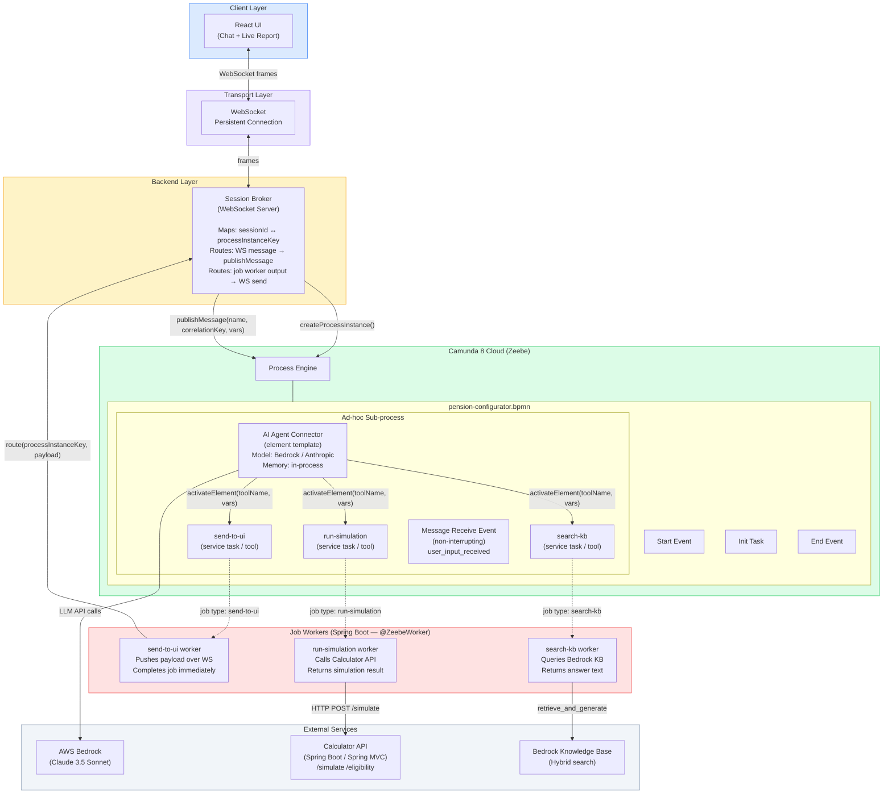

# Architecture Design: WebSocket + Camunda AI Agent Connector

## Overview

The system is a conversational pension configurator for Danica Pension. A user interacts with an AI agent via a real-time chat interface, the agent collects information, runs simulations, and delivers a live report — all orchestrated through Camunda 8's AI Agent Connector rather than custom LLM code.

The core shift from the previous design:

| Aspect | Previous | New |
|--------|----------|-----|
| UI↔Backend | REST polling every 2s | WebSocket (persistent, push) |
| LLM orchestration | Custom Python (boto3 + prompts) | Camunda AI Agent Connector |
| Tool routing | Manual in Python workers | Native connector ad-hoc sub-process |
| User input delivery | Variable write via REST | Message correlation via `publishMessage` |
| Agent loop | Explicit BPMN + Python logic | Managed by Zeebe + connector internally |

---

## Architecture Diagram



---

## Component Descriptions

### 1. React UI (`ui/`)

**Role:** Real-time chat interface + live simulation report panel.

**Responsibilities:**
- Opens a WebSocket connection to the Session Broker on load
- Sends user messages as JSON frames: `{ type: "user_message", content: "..." }`
- Receives typed server frames and dispatches to UI state:
  - `type: "agent_message"` → append to chat
  - `type: "summary"` → display summary card
  - `type: "report"` → render live report panel
  - `type: "question"` → show input prompt
  - `type: "error"` → display error banner
- Removed: polling interval, Camunda REST variable reads/writes

**Key changes from previous:** Replace `setInterval` polling + REST variable fetching with a single `useEffect` WebSocket setup.

---

### 2. Session Broker (`broker/`)

**Role:** Stateful WebSocket server that bridges browser connections to Camunda process instances.

**Responsibilities:**
- Accept WebSocket connections; assign each a `sessionId`
- On connection: call Camunda REST `POST /v2/process-instances` → store `processInstanceKey` in session map
- On WebSocket message from UI: look up `processInstanceKey`, call Camunda `publishMessage()`
- Expose an internal HTTP endpoint (`POST /send`) called by the `send-to-ui` job worker to push payloads to the correct WebSocket connection
- Clean up session map on WebSocket disconnect or process end

**Session map entry:**
```
sessionId → {
  ws: WebSocket,
  processInstanceKey: string,
  state: "active" | "waiting" | "complete"
}
```

**Technology:** Spring Boot (`spring-websocket` + STOMP). Stateless except for the in-memory session map (can be Redis-backed for horizontal scaling with Spring Session).

---

### 3. BPMN Process (`bpmn/pension-configurator.bpmn`)

**Role:** Orchestrates the complete pension configuration conversation as a durable process.

**Structure:**
```
[Start Event]
    ↓
[Script Task: init-context]
  Sets default product variables, sessionId binding
    ↓
[Ad-hoc Sub-process] ← AI Agent Connector applied here
  Configured with:
    - Provider: AWS Bedrock (Claude 3.5 Sonnet)
    - System prompt: pension advisor persona + tool descriptions
    - Memory: in-process (sliding window, 40 messages)
    - Tools: send-to-ui, run-simulation, search-kb
  Contains:
    ├─ [Service Task: send-to-ui]       type=send-to-ui
    ├─ [Service Task: run-simulation]   type=run-simulation
    ├─ [Service Task: search-kb]        type=search-kb
    └─ [Message Receive Event]          name=user_input_received (non-interrupting)
    ↓
[End Event]
```

**Element template applied to ad-hoc sub-process:**
`agenticai-aiagent-job-worker.json` — this is the job worker variant that supports non-interrupting events (required for the send-and-wait pattern).

**Message correlation key:** `processInstanceKey` (injected as process variable at start, used as the correlation key for `publishMessage` calls).

---

### 4. AI Agent Connector (Camunda built-in)

**Role:** Native Zeebe connector that manages the LLM → tool-call → result → LLM loop.

**How it works internally:**
1. Zeebe creates a job for the ad-hoc sub-process entry
2. Connector worker picks up the job, assembles the conversation (system prompt + history + current user message)
3. Calls LLM API → receives response with zero or more tool calls
4. If tool calls present: activates the matching service task elements in the sub-process, each receives `toolCall` variables
5. When tool service tasks complete with `toolCallResult`, Zeebe triggers a new connector job
6. Connector assembles tool results → calls LLM again
7. Repeat until LLM returns no tool calls → `completionConditionFulfilled = true` → sub-process ends

**Safety limits:** Max 10 LLM calls per sub-process entry. For longer flows, the process can re-enter the sub-process.

**AgentContext** (stored as a Zeebe process variable between iterations):
```json
{
  "state": "READY",
  "metadata": { "provider": "bedrock", "model": "..." },
  "metrics": { "modelCalls": 3, "inputTokens": 1240, "outputTokens": 380 },
  "toolDefinitions": [...],
  "conversation": { "cursor": "..." }
}
```

---

### 5. Job Workers (`workers/`)

These are standard Zeebe job workers (Spring Boot, `camunda-zeebe-spring-boot-starter`). Unlike the previous design, they contain **no LLM logic** — they are pure tool implementations called by the connector.

#### `send-to-ui` Worker
- Receives: `toolCall.payload` (JSON), `toolCall.messageType` (`summary` | `report` | `agent_message` | `question`)
- Action: `POST /send` to the Session Broker with `{ processInstanceKey, messageType, payload }`
- Returns: `toolCallResult = "delivered"` (or error string)
- Completes the job immediately — no blocking

#### `run-simulation` Worker
- Receives: `toolCall` variables (age, salary, contribution, riskProfile, etc.)
- Action: `POST /simulate` to Calculator API
- Returns: `toolCallResult` = simulation result JSON as string

#### `search-kb` Worker
- Receives: `toolCall.query`
- Action: `retrieve_and_generate()` via Bedrock Knowledge Base
- Returns: `toolCallResult` = answer text

---

### 6. Calculator API (`api/`)

Spring Boot service exposing `/simulate`, `/eligibility`, `/products/{code}/defaults`. Stateless REST API (Spring MVC). Called exclusively by the `run-simulation` job worker.

---

## Key Design Decisions

### WebSocket over SSE or polling
WebSocket is bidirectional — the UI needs to both receive agent messages and send user replies. SSE is receive-only; polling introduced 2s latency and unnecessary load. WebSocket is the natural fit.

### Camunda AI Agent Connector over custom orchestration
The connector eliminates ~300 lines of Python orchestration code (`workers/tools/workers.py`) and replaces it with a battle-tested, provider-agnostic implementation. The tradeoff is reduced flexibility for custom loop logic (e.g., the sufficiency scoring threshold), which must be modeled as a tool that returns a structured result rather than inline Python.

### Job Worker flavor over Outbound Connector flavor
The **job worker** variant (`agenticai-aiagent-job-worker`) must be used because it supports **non-interrupting events** — essential for the "send summary, wait for user, continue" pattern. The outbound connector variant does not support events.

### In-process memory
Conversation history stored directly in `AgentContext` as a Zeebe variable. Adequate for single-session flows. For multi-session or long conversations, switch to Camunda Document Storage.

### Session Broker as the message router
Rather than having each job worker know how to find a WebSocket connection, the broker is the single point of contact. Job workers call the broker's internal HTTP endpoint with the `processInstanceKey`; the broker resolves the WebSocket. This decouples workers from transport details.

### Message correlation key = processInstanceKey
Process instance keys are unique and available in all workers via the job context. Using them as the correlation key avoids a separate ID generation step.

---

## Technology Stack

| Layer | Technology | Notes |
|-------|-----------|-------|
| Frontend | React + Vite | 18.3 / 5.4 |
| WebSocket (client) | Browser WebSocket API | native, no library |
| Session Broker | Spring Boot (`spring-websocket`) | STOMP · Java 17+ |
| Process Engine | Camunda 8 Cloud (Zeebe) | 8.8+ |
| AI Agent Connector | Camunda agentic-ai connector | `agenticai-aiagent-job-worker` variant |
| LLM | AWS Bedrock (Claude 3.5 Sonnet) | `anthropic.claude-3-5-sonnet-20241022-v2:0` |
| Job Workers | Spring Boot (`camunda-zeebe-spring-boot-starter`) | `@ZeebeWorker` · Java 17+ |
| Calculator API | Spring Boot (Spring MVC) | Stateless REST · Java 17+ |
| Knowledge Base | AWS Bedrock KB | Titan Embeddings v2 · hybrid search |

---

## Non-Functional Characteristics

**Durability:** Camunda persists the full process state. If the Session Broker restarts, reconnecting WebSocket clients can resume by passing their `processInstanceKey` — the process is still alive in Zeebe.

**Scalability:** The Session Broker is the only stateful component. It can be horizontally scaled by moving the session map to Redis. Workers are stateless and scale independently.

**Observability:** Camunda Operate provides full process instance visibility. `AgentContext.metrics` tracks token usage per session. The Session Broker should emit structured logs per session event.
