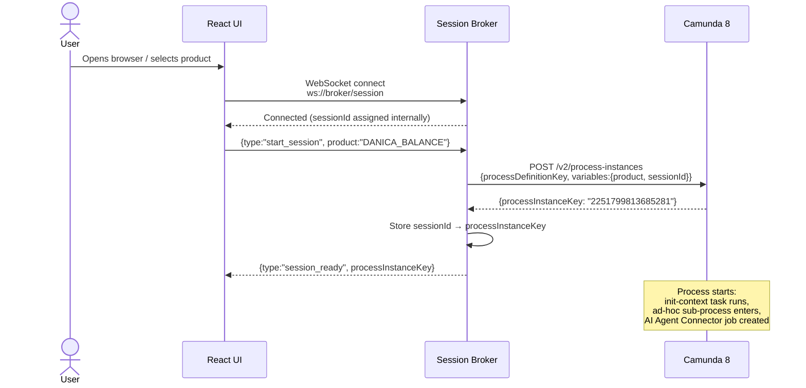
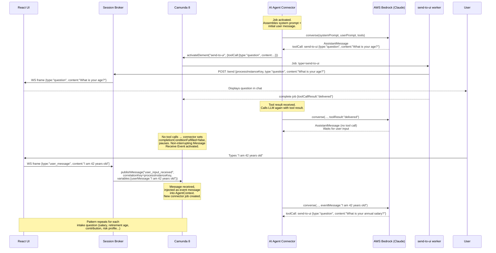
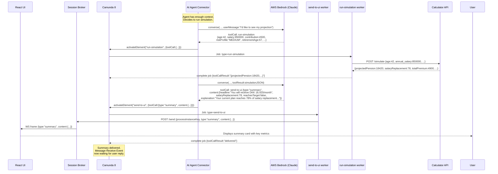
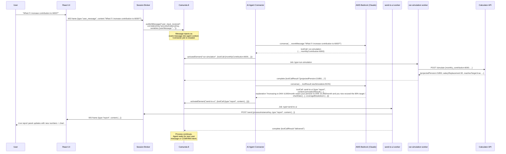
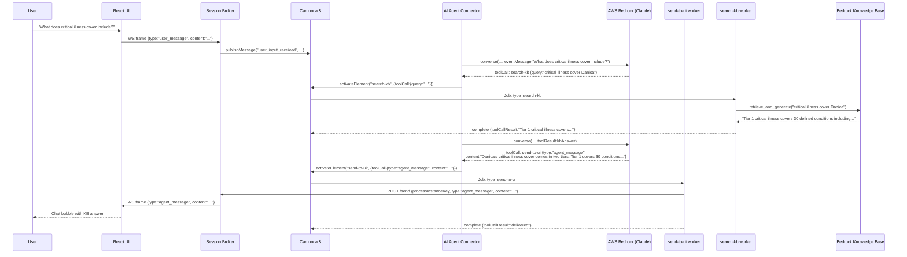
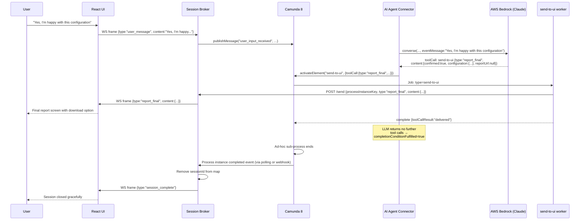
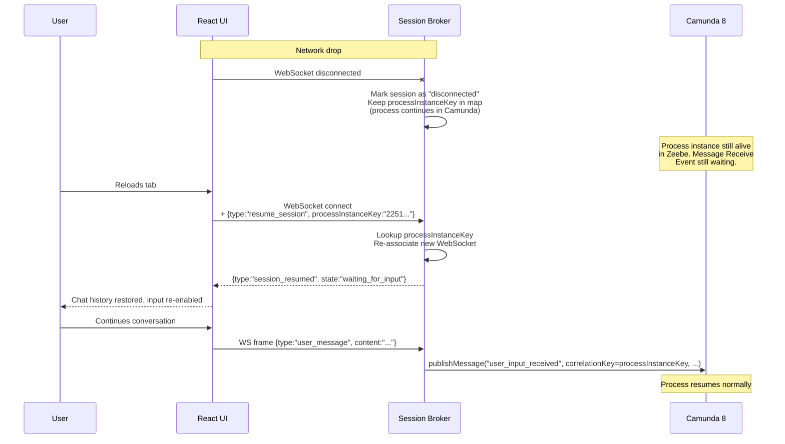

# Sequence Diagrams

All diagrams use Mermaid syntax and are renderable in GitHub, Notion, and most markdown viewers.

---

## 1. Session Initialisation

How a browser WebSocket connection becomes a live Camunda process instance.

---

## 2. AI Agent Intake — Collecting User Information

The AI agent asks questions to collect pension configuration data from the user.

---

## 3. Simulation Run + Summary Delivery

After enough information is collected, the agent runs a simulation and sends the summary.

---

## 4. Parameter Change + Live Report Delivery

User adjusts a parameter; agent updates the simulation and delivers the full live report.

---

## 5. Knowledge Base Query

User asks a policy question; agent delegates to the KB tool.

---

## 6. Session End — Report Confirmed

User confirms and receives the final report.

---

## 7. Error Handling — Connection Drop and Resume

WebSocket disconnects and user reconnects with their session token.

